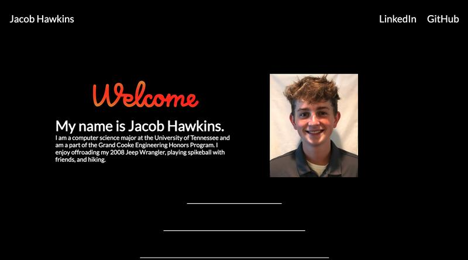

# personal-website

Welcome to my Personal Site! I built this using the ReactJS JavaScript Framework. Through this project I have learned the basics of the ReactJS Framework and created a user interface that is well-designed, simple to use, and shows a little bit about me. I hope you enjoy!

## To Visit
Click [here](https://jacobhawkins.net/) or visit `https://jacobhawkins.net/`

## To Run
1. Fork repository
2. Run `npm install` inside website folder
3. Run `npm start` to begin hosting locally
4. The browser should open automatically, but if not, visit the link specified in terminal window

## Built with:
ReactJS, CSS, AOS Scroll Animations

## Key Concepts:
JavaScript Frameworks, Animation, Scroll Animations, SVG Manipulation/Animation
